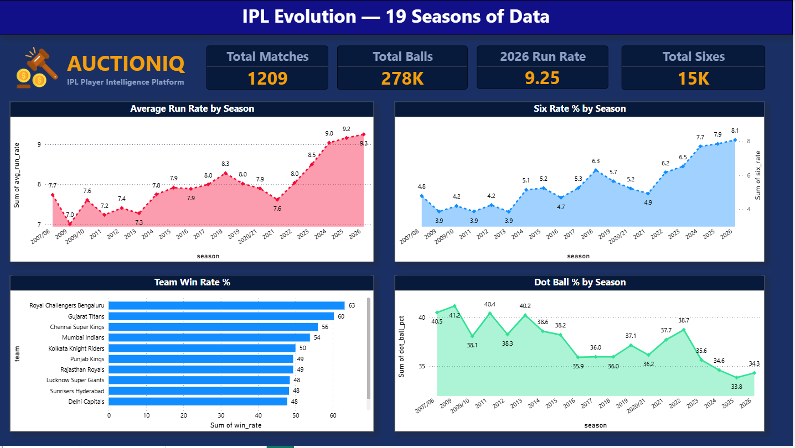
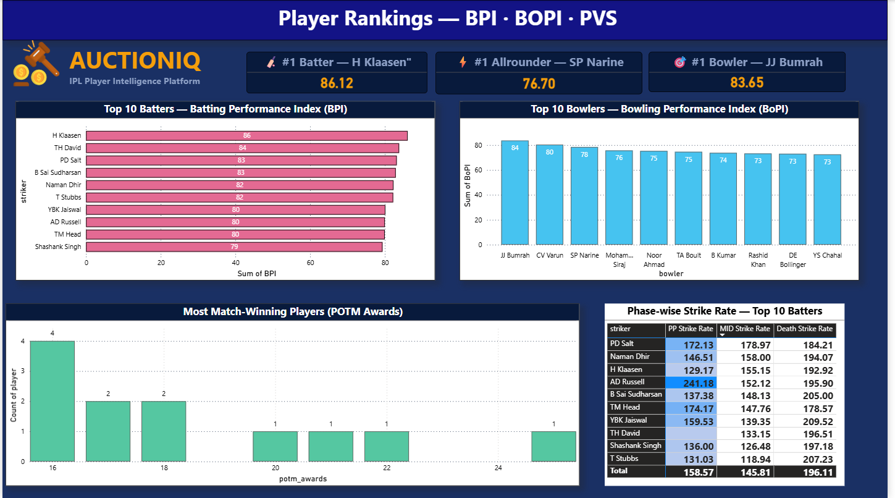
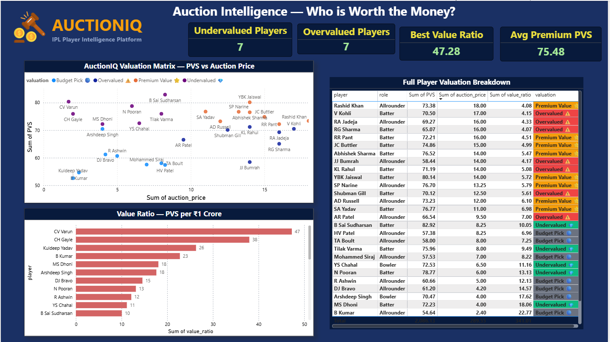

# ⚡ AuctionIQ — IPL Player Valuation & Auction Intelligence

> **CV Varun at ₹1.7Cr delivers 47x more value per crore than Rohit Sharma at ₹16Cr.**
> Most IPL franchises don't know this. AuctionIQ does.

[](https://python.org)
[](https://powerbi.microsoft.com)
[](https://pandas.pydata.org)
[](https://cricsheet.org)

---

## 🎯 The Problem

IPL franchises spend ₹100+ crore in auctions making decisions based on
basic statistics — career averages, strike rates, reputation. Smaller
franchises especially cannot afford full analytics teams, so they overpay
for big names and miss the players who actually win matches per rupee spent.

**AuctionIQ changes that.** It's a data-driven player valuation platform
built on 287,513 ball-by-ball records across 19 IPL seasons — giving any
franchise the same analytical edge as the biggest teams in the league.

---

## 🔥 Key Findings

| Finding | Insight |
|---|---|
| 💎 Most Undervalued | CV Varun — ₹1.7Cr · Value Ratio **47.28** |
| ⚠️ Most Overvalued | RG Sharma — ₹16Cr · Value Ratio **4.07** |
| 🏏 #1 Batter (BPI) | H Klaasen — BPI **86.12** |
| 🎯 #1 Bowler (BoPI) | JJ Bumrah — BoPI **83.65** |
| 🌟 #1 Allrounder | SP Narine — only TRUE allrounder in top 15 |
| 💥 Death Over King | AB de Villiers — SR **222.9** in death overs |
| ⚡ Powerplay Beast | AD Russell — SR **241.2** in powerplay |
| 📈 IPL Evolution | Run rate grew 7.74 → 9.25 over 19 seasons (**+20%**) |
| 🔺 Six Rate | Doubled from **4.78% → 8.08%** across 19 seasons |

---

## 📊 Dataset

| Metric | Value |
|---|---|
| Source | Cricsheet.org — ball-by-ball IPL data |
| Seasons | 19 (2007/08 → 2026) |
| Matches | 1,209 |
| Total Balls | 287,513 |
| Batters Ranked | 229 |
| Bowlers Ranked | 191 |
| Total Players | 306 |

---

## 🔬 Methodology

### Batting Performance Index (BPI)
A weighted composite of 6 metrics designed to capture *context-adjusted* batting value:

| Metric | Weight |
|---|---|
| Recent Strike Rate (2023–25) | 25% |
| Death Over Strike Rate | 20% |
| Career Strike Rate | 20% |
| Batting Average | 15% |
| Boundary % | 10% |
| Consistency Score | 10% |

### Bowling Performance Index (BoPI)
A weighted composite of 6 metrics focused on modern T20 bowling demands:

| Metric | Weight |
|---|---|
| Recent Economy (2023–25) | 20% |
| Recent Wicket Rate | 20% |
| Career Wicket Rate | 20% |
| Career Economy | 15% |
| Dot Ball % | 15% |
| Death Economy | 10% |

### Player Value Score (PVS)
- **Batter**: PVS = BPI
- **Bowler**: PVS = BoPI
- **Allrounder**: PVS = (BPI × 0.5) + (BoPI × 0.5) + 5 bonus

### Auction Valuation Model
```
Value Ratio = PVS ÷ Auction Price (₹Cr)
```
| Quadrant | Meaning |
|---|---|
| High PVS + Low Price | 💎 Undervalued — buy immediately |
| High PVS + High Price | ✅ Premium — justified spend |
| Low PVS + High Price | ⚠️ Overvalued — avoid |
| Low PVS + Low Price | 📦 Budget — situational |

---

## 📈 Dashboard

3-page Power BI dashboard with interactive filters by player, team, phase, and season.

### Page 1 — IPL Evolution (19 seasons of macro trends)


### Page 2 — Player Rankings (BPI · BoPI · PVS)


### Page 3 — Auction Intelligence (Value Ratio Matrix)


---

## 🛠️ Tech Stack

| Layer | Tools |
|---|---|
| Data Source | Cricsheet.org ball-by-ball CSV |
| Processing | Python · Pandas · NumPy |
| Analysis | Statistical modelling · Weighted indices |
| Visualisation | Matplotlib · Seaborn |
| Dashboard | Power BI · DAX |
| Version Control | Git · GitHub |

---

## 📁 Project Structure

```
AuctionIQ/
│
├── notebooks/
│   ├── 00_data_exploration.ipynb     ← load & clean 287K balls
│   ├── 01_batting_analysis.ipynb     ← BPI for 229 batters
│   ├── 02_bowling_analysis.ipynb     ← BoPI for 191 bowlers
│   ├── 03_player_index.ipynb         ← PVS + auction valuation
│   └── 04_dashboard_prep.ipynb       ← 8 Power BI export files
│
├── exports/                          ← Power BI data sources
│   ├── player_index.csv
│   ├── batting_top100.csv
│   ├── bowling_top100.csv
│   ├── auction_valuation.csv
│   ├── season_trends.csv
│   ├── team_stats.csv
│   ├── potm_awards.csv
│   └── phase_batting.csv
│
├── screenshots/                      ← dashboard previews
├── AuctionIQ DASHBOARD.pbix          ← Power BI file
├── requirements.txt
└── README.md
```

---

## 🚀 How to Run

```bash
# Clone the repo
git clone https://github.com/h4rshalk/AuctionIQ.git
cd AuctionIQ

# Create virtual environment
python -m venv venv
venv\Scripts\activate        # Windows
source venv/bin/activate     # Mac/Linux

# Install dependencies
pip install -r requirements.txt

# Download IPL data
# → https://cricsheet.org/downloads/ipl_csv2.zip
# → Extract all CSV files into data/raw/

# Run notebooks in order: 00 → 01 → 02 → 03 → 04
```

---

## 💼 Business Applications

- **IPL Franchise Analysts** — identify undervalued players before auction day
- **Fantasy Cricket** — data-driven team selection based on phase-wise performance
- **Sports Media & Broadcast** — evidence-based player comparison for commentary
- **Coaching Staff** — phase-wise weakness analysis per batter-bowler matchup
- **Scouting** — surface domestic players with IPL-ready profiles at budget prices

---

## 👤 Author

**Harshal Kawane**
B.E. Computer Engineering · Data Science & AI
📍 Pune, Maharashtra, India
📧 harshalkawane3@gmail.com
🔗 [LinkedIn](https://linkedin.com/in/harshal-kawane) · [GitHub](https://github.com/h4rshalk)

*Open to roles in cricket analytics, sports data science, and performance analysis.*

---

> *"IPL franchises spend crores on intuition. AuctionIQ spends seconds on data."*
